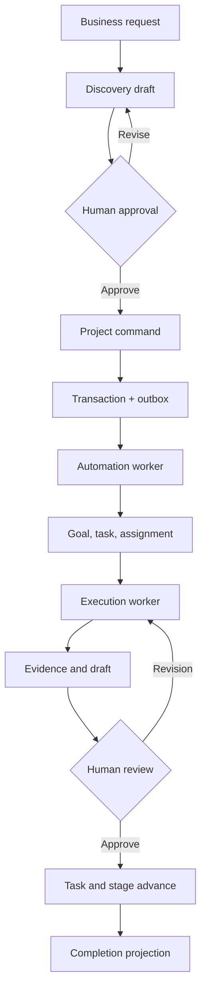

# NeureCore Autonomous Work Layer — Reconstruction Roadmap

**Roadmap ID:** NC-AWL-R1  
**Version:** 1.1 — Infrastructure and Schedule Correction  
**Date:** 2026-07-26  
**Status:** PROPOSED — EXECUTIVE AND TECHNICAL APPROVAL REQUIRED  
**Scope:** Reconstruction of NeureCore’s autonomous work layer without rebuilding the functioning enterprise SaaS foundation  
**Primary release gate:** One governed AI employee completes one real project task end to end, with evidence, human approval, lifecycle progression, and a complete audit trail  

---

## 1. Executive Decision

NeureCore must immediately stop horizontal feature expansion and reconstruct its autonomous work capability as one controlled vertical product slice.

The reconstruction must preserve the functioning platform foundation:

- Authentication, authorization, and tenant isolation
- Customers, departments, projects, and industry configuration
- Existing frontend shell and workspace patterns
- Prisma/PostgreSQL persistence where validated
- AI employee templates and deployment concepts
- Approval, audit, observability, and policy concepts
- LangGraph where it serves governed orchestration
- Existing in-process and database-polling mechanisms only as temporary legacy infrastructure pending Phase 0 verification

The reconstruction must replace or redesign only the pathways that prevent governed AI work from moving reliably from business intent to completed, reviewed output.

This is not a rewrite of NeureCore. It is a bounded reconstruction of the autonomous work layer.

### 1.1 Strategic outcome

At the end of this roadmap, a user must be able to:

1. Select a customer.
2. Describe a business objective conversationally.
3. Review and approve a synthesized project.
4. Create exactly one project.
5. Generate at least one goal and one executable task.
6. Assign a suitable AI employee automatically or manually through a usable picker.
7. Dispatch the task through a durable execution queue.
8. Observe execution progress and evidence.
9. Review, approve, reject, or request revision.
10. Advance task, stage, and project state according to explicit rules.
11. Inspect every action in one chronological audit timeline.
12. Recover safely from interruption, retry, timeout, or worker failure.

### 1.2 Non-goals during reconstruction

The following are frozen until the golden path passes its release gates:

- Additional industries or sub-industries
- New AI employee templates unrelated to the golden path
- New dashboards, navigation areas, or workspace variants
- Additional autonomy modes
- Multi-agent collaboration beyond what the golden path requires
- Cosmetic redesign unrelated to usability blockers
- Broad marketplace expansion
- New orchestration frameworks
- New infrastructure products without an approved architectural need
- Refactors that do not reduce golden-path risk

---

## 2. Assessment of the Revised Failure Audit

The revised audit is directionally sound and suitable as the basis for reconstruction, with one evidence correction:

> A condition observed in source is source-confirmed; the exact production failure mechanism remains a hypothesis until correlated runtime traces demonstrate that the deployed request followed that path.

Accordingly:

| Finding | Current confidence | Required confirmation |
|---|---|---|
| Hermes project creation fails in SIM-01 | Confirmed in browser | Trace gateway, registry, schema, command, and response |
| `createProject` absent from referenced static tool sets | Source-confirmed | Verify deployed commit, dynamic registration, actual Hermes type and tool name |
| Direct Prisma fallback exists | Source-confirmed | Prove whether deployed runtime entered it |
| Team assignment requires UUID input | Source-confirmed and UX-confirmed | Validate all alternative assignment surfaces |
| Execution-log button lacks handler | Source-confirmed | Verify whether another supported log surface exists |
| End-to-end autonomous execution works | Not demonstrated | Trace all queues, workers, schedulers, graphs, and task events |
| Autonomous pipeline is completely absent | Unproven | Complete Phase 0 capability trace |

No destructive redesign may begin before Phase 0 resolves these uncertainties.

---

## 3. Reconstruction Principles

### 3.1 One golden path before platform breadth

Every implementation decision must improve the approved golden path. Work that cannot name the golden-path failure or acceptance criterion it addresses must be deferred.

### 3.2 Commands, not database tools

AI tools, browser actions, scheduled triggers, and internal services must invoke the same application commands. They must not implement separate business logic or mutate business entities directly through Prisma.

Required mutation path:

```text
UI/Hermes/System Trigger
        ↓
Application Command
        ↓
Policy and Authorization
        ↓
Domain Service
        ↓
Database Transaction + Outbox
        ↓
Durable Worker
        ↓
Projection/Audit/Notification
```

### 3.3 At-least-once delivery with idempotent effects

Queues and outbox workers should be assumed to deliver an event more than once. Every consumer must therefore have an idempotency key and a uniqueness boundary.

### 3.4 Explicit state, no implied completion

Creating an agent is not assignment. Assignment is not execution. Generating text is not task completion. Task completion is not project completion.

Each must be represented as a separate, validated state transition.

### 3.5 Human authority remains explicit

The AI may plan and execute within approved boundaries. Material decisions and external side effects require policy evaluation and, where configured, human approval.

### 3.6 Failure must be visible and recoverable

No core automation may fail only in logs. The user must see whether automation is pending, running, awaiting input, awaiting review, retrying, failed, or completed.

### 3.7 One source of truth

Backend state is authoritative. The frontend must render persisted state and must not infer durable completion from a toast, chat response, optimistic state, or transient socket event.

### 3.8 Tenant isolation at every hop

Tenant identity must be included and validated in commands, jobs, events, queries, logs, artifact storage, and projections.

### 3.9 Infrastructure must be proven, not assumed

The current architecture documentation states that no external Redis/BullMQ queue is deployed and that background work relies on in-process timers or database polling. Phase 0 must verify the deployed reality.

Until that verification is complete:

- BullMQ, Redis, durable queues, distributed locks, and queue dashboards must be treated as absent.
- In-process `setInterval` execution must not be treated as durable.
- Database polling must be evaluated for locking, leases, retries, duplicate delivery, horizontal scaling, and stuck-work recovery.
- The team must choose deliberately between a PostgreSQL-backed durable worker/outbox implementation and introducing Redis/BullMQ.
- Timeline, operations, security, and certification estimates must include whichever queue infrastructure is selected.

No phase may use an assumed queue capability as evidence that work is durable.

---

## 4. Golden Workflow

### 4.1 Reference scenario

Use one test tenant and one accounting scenario:

**Customer:** `[GOLDEN] Bakers Pizza`  
**Project:** `[GOLDEN] July 2026 Bookkeeping Close`  
**Goal:** Complete and review the July bookkeeping close  
**Task:** Prepare a draft bank reconciliation from explicitly supplied synthetic source data  
**AI employee:** Bookkeeper  
**Human role:** Project Owner/Reviewer  

No real financial records or external communications are required.

### 4.2 Golden-path sequence



### 4.3 Golden-path invariant

For one approved initiation request:

- Exactly one project exists.
- Exactly one project-created event is processed effectively.
- Expected goals/tasks are created exactly once.
- Each task has one current accountable assignee.
- Each execution attempt has a unique identity.
- Every output belongs to the correct tenant, project, task, and attempt.
- Human approval is attributable and cannot be fabricated by the AI.
- Final state persists after refresh, relogin, worker restart, and socket reconnection.

---

## 5. Target Architecture

### 5.1 Bounded components

| Component | Responsibility | Must not do |
|---|---|---|
| Enterprise Initiation UI | Capture intent, show discovery, request confirmation | Write projects directly |
| Hermes initiation adapter | Convert conversation into typed command drafts | Own business state or bypass approval |
| Command bus/application service | Validate and dispatch commands | Contain UI-specific behavior |
| Policy engine | Tenant, role, approval, and action policy evaluation | Mutate domain records |
| Project domain service | Enforce project creation and lifecycle invariants | Start unreliable fire-and-forget workflows |
| Transactional outbox | Persist events atomically with domain changes | Execute business work |
| Automation worker | Materialize project shape into goals/tasks/assignments | Invent unauthorized project changes |
| Assignment service | Match task requirements with eligible AI employees | Execute the task |
| Execution orchestrator | Create and control execution attempts | Approve its own results |
| AI employee runtime | Plan/use tools/create evidence within policy | Change authoritative lifecycle state directly |
| Review service | Record human decision and revision instructions | Accept unauthenticated approvals |
| Projection service | Build timeline, status, and read models | Become source of transactional truth |
| Realtime gateway | Deliver state notifications | Be required for correctness |

### 5.2 Recommended runtime path

```text
POST /enterprise-initiations
POST /enterprise-initiations/{id}/messages
POST /enterprise-initiations/{id}/approve
                 ↓
ApproveEnterpriseInitiationCommand
                 ↓
ProjectDomainService.createFromApprovedInitiation()
                 ↓
[project + initiation link + outbox event] in one transaction
                 ↓
ProjectAutomationWorker
                 ↓
[goals + tasks + assignments + audit events]
                 ↓
TaskExecutionRequested outbox event
                 ↓
TaskExecutionWorker / LangGraph run
                 ↓
[attempt + evidence + review request + audit events]
```

### 5.3 Reliability boundary

PostgreSQL transaction plus transactional outbox is the correctness boundary. Socket.IO, notifications, and frontend caches are delivery conveniences only.

Phase 0 and Phase 1 must select one supported durable execution design:

1. **PostgreSQL-backed outbox and leased worker:** Preferable when minimizing infrastructure expansion is more important than high queue throughput.
2. **PostgreSQL outbox plus Redis/BullMQ:** Preferable when operational requirements justify a separate queue, and Redis deployment, security, backup, monitoring, and recovery are funded as program deliverables.

In-process timers may temporarily publish or poll, but they are not the reliability boundary.

If BullMQ is selected and introduced:

- The outbox publisher places stable event IDs onto BullMQ.
- Job IDs derive from event IDs or execution-attempt IDs.
- Workers perform idempotency checks before mutation.
- Job completion does not equal domain completion until the database transaction commits.
- Dead-lettered jobs remain visible and retryable through controlled operations.

If PostgreSQL polling is selected:

- Workers claim work using transaction-safe row locking or leases.
- Lease expiry, heartbeat, retry, concurrency, and stale-work recovery are explicit.
- Multiple worker replicas cannot process the same effective mutation twice.
- Polling indexes, retention, vacuum impact, and backlog behavior are load-tested.

### 5.4 Tool boundary

Tools should be thin adapters:

```typescript
interface BusinessTool<Input, Output> {
  execute(input: Input, context: ToolContext): Promise<Output>;
}
```

The adapter must:

1. Validate the typed input.
2. build a command with tenant, actor, causation, correlation, and idempotency metadata.
3. call an application command handler.
4. return the authoritative command result.

It must not:

- Call `prisma.*.create/update/delete` for business mutations.
- Silently degrade to reduced behavior.
- Report success when required downstream initialization failed.
- invent authorization or tenancy context.

---

## 6. Canonical Domain State Models

Final enum names may follow existing conventions, but their semantics must remain explicit.

### 6.1 Enterprise initiation

```text
DRAFT
→ DISCOVERING
→ READY_FOR_CONFIRMATION
→ APPROVED
→ MATERIALIZING
→ COMPLETED

Exceptional:
NEEDS_INPUT | FAILED_RETRYABLE | FAILED_FINAL | CANCELLED
```

### 6.2 Project automation

```text
NOT_REQUESTED
→ REQUESTED
→ PROCESSING
→ COMPLETED

Exceptional:
PARTIAL | FAILED_RETRYABLE | FAILED_FINAL
```

### 6.3 Task

```text
DRAFT
→ READY
→ ASSIGNED
→ QUEUED
→ IN_PROGRESS
→ NEEDS_INPUT
→ NEEDS_REVIEW
→ APPROVED
→ COMPLETED

Exceptional:
BLOCKED | FAILED_RETRYABLE | FAILED_FINAL | CANCELLED
```

### 6.4 Execution attempt

```text
CREATED
→ QUEUED
→ RUNNING
→ WAITING_FOR_TOOL
→ PRODUCING_EVIDENCE
→ SUBMITTED_FOR_REVIEW

Exceptional:
PAUSED | NEEDS_INPUT | TIMED_OUT | FAILED_RETRYABLE |
FAILED_FINAL | CANCELLED
```

An execution attempt must never directly become `APPROVED`; approval belongs to a human-controlled review decision.

### 6.5 Review

```text
PENDING
→ APPROVED

Alternative decisions:
REVISION_REQUESTED | REJECTED | CANCELLED
```

### 6.6 Project lifecycle

Keep sales/engagement lifecycle separate from work-execution state. A proposed baseline:

```text
LEAD → PROPOSAL_SENT → WON → ACTIVE → REVIEW → COMPLETED
```

Transition guards must be configured and tested. For example, `REVIEW → COMPLETED` requires all mandatory tasks to be approved or explicitly waived by an authorized human with a reason.

---

## 7. Minimum Data Contracts

Reuse existing models where they satisfy these contracts. Add or migrate only what is missing.

### 7.1 Required identities

Every command/event/job/log must carry:

- `tenantId`
- `actorId`
- `actorType`
- `correlationId`
- `causationId`
- `idempotencyKey`
- `occurredAt`
- `schemaVersion`

### 7.2 Outbox event

Minimum fields:

```text
id
tenantId
eventType
aggregateType
aggregateId
payload
schemaVersion
correlationId
causationId
idempotencyKey
status
attemptCount
availableAt
lockedAt
lockedBy
processedAt
lastErrorCode
lastErrorSummary
createdAt
```

Do not store secrets or unrestricted model prompts in generic event payloads.

### 7.3 Execution attempt

Minimum fields:

```text
id
tenantId
projectId
taskId
agentId
status
attemptNumber
inputSnapshotRef
policySnapshotRef
graphVersion
modelProvider
modelName
startedAt
heartbeatAt
completedAt
failureCode
failureSummary
tokenUsage
estimatedCost
correlationId
createdAt
updatedAt
```

### 7.4 Evidence artifact

Minimum fields:

```text
id
tenantId
projectId
taskId
executionAttemptId
artifactType
storageRef
mimeType
checksum
source
createdByActorId
createdAt
metadata
```

### 7.5 Review decision

Minimum fields:

```text
id
tenantId
taskId
executionAttemptId
reviewerId
decision
comment
decisionAt
correlationId
```

---

## 8. Program Governance

### 8.1 Reconstruction team

At minimum, assign accountable owners for:

| Role | Accountability |
|---|---|
| Product owner | Golden scenario, scope, and acceptance |
| Architecture owner | Boundaries, decision records, exception approval |
| Backend lead | Commands, domain services, outbox, workers |
| AI/orchestration lead | LangGraph/runtime, tools, evidence behavior |
| Frontend lead | Initiation, assignment, execution, review, recovery UX |
| QA lead | Contract, integration, browser, failure-injection tests |
| Platform/operations owner | Queues, deployments, telemetry, runbooks |
| Security reviewer | Tenant isolation, permissions, tool policies, data handling |

One person may hold multiple roles, but every accountability must have a named owner.

### 8.2 Decision controls

- Record architectural decisions in ADRs.
- No new service/module without a documented boundary.
- No direct Prisma mutation exception without architecture approval and expiry date.
- No phase closes on code completion alone.
- Phase closure requires evidence from its acceptance gate.
- Do not mark a failure “fixed” until the deployed golden-path test passes.

The architecture owner may approve refactors that are necessary but not independently sufficient for the golden path, including breaking circular NestJS module dependencies, separating application and infrastructure modules, and correcting dependency direction. Every such refactor must:

- Name the blocked golden-path dependency it enables.
- Define its boundary and regression surface.
- Include focused characterization tests before structural change.
- Avoid unrelated cleanup.
- Be recorded in an ADR or scoped refactor decision.

### 8.3 Definition of done

A backlog item is done only when:

- Code, validation, and tenant scoping are implemented.
- Unit and integration tests pass.
- Observability is present.
- Failure behavior is tested.
- User-visible states are handled.
- Documentation/runbook changes are complete.
- The behavior is verified in the deployed reconstruction environment.

---

## 9. Phased Reconstruction Plan

The expected duration is approximately **17–21 weeks** for a focused team, including enabling infrastructure and expected iteration at the execution-runtime gate. This is a planning range, not a deadline guarantee. Calendar estimates are subordinate to gates; phases do not pass merely because their planned time elapsed.

### Phase 0 — Freeze, Baseline, and Runtime Forensics

**Duration:** 1.5–2 weeks  
**Objective:** Establish the actual deployed execution path and stop further architectural drift.

#### Work

1. Declare a feature freeze for the prohibited expansion areas.
2. Identify deployed frontend/backend commit SHAs, environment, database, Redis, workers, and feature flags.
3. Inventory all project/task/agent mutation entry points:
   - Controllers
   - Hermes tools
   - Other agent tools
   - Scheduled jobs
   - Queue processors
   - Direct Prisma mutations
4. Trace one Hermes project-creation request using a single correlation ID.
5. Record:
   - Runtime Hermes type
   - Offered tools
   - Selected tool and arguments
   - Gateway decision
   - Policy decision
   - Command/service reached
   - Database mutation
   - Outbound event/job
   - Automation result
   - Frontend response
6. Trace manual project creation through the same layers.
7. Verify the documented absence of Redis/BullMQ and inventory all in-process timers, database pollers, schedulers, LangGraph entry points, task dispatch paths, and agent runtimes.
8. Produce a direct-Prisma mutation inventory using reproducible search rules.
9. Reconcile the source audit with the deployed commit.
10. Capture the current golden-path result without attempting broad fixes.
11. Assess current CI/CD enforcement, pre-commit hooks, architectural tests, deployment promotion, rollback, and environment parity.
12. Assess existing feature flags and prove whether any are tenant-scoped.
13. Design the minimum test-harness foundation needed for reconstruction:
    - Repeatable test-tenant provisioning or deterministic tenant reset
    - Synthetic accounting inputs
    - Created-record inventory and cleanup
    - Correlation-ID capture
    - Machine-readable test results
    - Failure-injection seams
14. Estimate and choose the durable work infrastructure options to take into Phase 1.

#### Deliverables

- Deployed-system manifest
- Current-state runtime sequence diagram
- Mutation-entry-point inventory
- Worker/queue/runtime inventory
- Direct-Prisma bypass register
- Confirmed root-cause report
- Frozen-scope register
- Baseline golden-path test report
- Queue/polling durability assessment and architecture options
- CI/CD and enforcement-gap assessment
- Feature-flag capability assessment
- Test-infrastructure design and implementation backlog

#### Gate G0

- Every golden-path hop is classified as implemented, partial, absent, bypassed, or unverified.
- Hermes failure is localized to a specific runtime boundary.
- The team knows whether an execution worker exists and how it is triggered.
- Tool-bypass count is exact and reproducible.
- No critical architectural decision rests solely on a code comment or browser symptom.
- The program has selected—or has an evidence-backed decision plan for selecting—PostgreSQL workers versus Redis/BullMQ.
- Test infrastructure, tenant-scoped flags, and CI enforcement are estimated as first-class work rather than presumed capabilities.

If G0 cannot produce a trustworthy map, do not proceed to implementation. Escalate through the following decision branch:

| Phase 0 finding | Program decision |
|---|---|
| Autonomous layer is structurally recoverable through targeted corrections | Proceed with this reconstruction roadmap |
| Platform foundation is sound but orchestration/integration boundaries are broken | Proceed with an integration-focused reconstruction and revise affected phase estimates |
| Core module boundaries, state ownership, or tenant/security model are fundamentally compromised | Produce a scoped replace-vs-rebuild decision with evidence, cost, migration impact, and rollback options |
| Deployed system cannot be reconciled with source or operated safely | Pause all autonomous development until environment and release integrity are restored |

No “scrap” or “continue patching” decision may be made without Phase 0 evidence.

---

### Phase 1 — Contracts, States, and Architectural Enforcement

**Duration:** 1.5 weeks  
**Objective:** Establish one enforceable application boundary before repairing individual features.

#### Work

1. Approve canonical states and transition guards.
2. Define typed commands:
   - `ApproveEnterpriseInitiation`
   - `CreateProjectFromInitiation`
   - `RequestProjectAutomation`
   - `CreateGoal`
   - `CreateTask`
   - `AssignTask`
   - `RequestTaskExecution`
   - `SubmitTaskForReview`
   - `ApproveTask`
   - `RequestTaskRevision`
   - `AdvanceProjectStage`
3. Define versioned domain events corresponding to successful state changes.
4. Standardize command metadata and error contracts.
5. Define idempotency ownership and uniqueness constraints.
6. Add lint/static-analysis guardrails preventing direct business mutations from tool adapters.
7. Define allowed repository access by module.
8. Enforce guardrails through CI as required merge gates; local hooks are advisory only.
9. Add architectural review ownership and a pull-request checklist for mutation, tenancy, idempotency, events, and recovery.
10. Build the minimum tenant-scoped feature-flag primitives required for controlled rollout, including:
    - Tenant override and global default
    - Server-side evaluation
    - Audit of flag changes
    - Safe default behavior
    - Emergency kill switch
11. Begin the reconstruction test-harness track defined in Phase 0.
12. Write ADRs for:
   - Command boundary
   - Transactional outbox
   - Queue semantics
   - State ownership
   - LangGraph role
   - Approval authority
   - Realtime as non-authoritative

#### Deliverables

- Command and event catalog
- State-transition specification
- Error-code catalog
- Idempotency matrix
- Architecture dependency rules
- CI enforcement and architectural-test configuration
- Tenant-scoped feature-flag foundation
- Initial automated test-tenant and synthetic-data harness
- ADR set
- Migration impact assessment

#### Gate G1

- Tools can no longer introduce new direct Prisma business mutations.
- Every golden-path mutation has one named command owner.
- Every state has a single authoritative writer.
- Duplicate delivery and retry semantics are defined before queue work begins.
- CI rejects prohibited tool-layer mutations.
- Tenant-scoped flags can isolate the canonical path from legacy behavior.
- The test harness can provision or reset at least one deterministic reconstruction tenant.

---

### Phase 2 — Secure Initiation and Project Creation

**Duration:** 2 weeks  
**Objective:** Make conversational initiation create exactly one recoverable project through the canonical command path.

#### Backend work

1. Verify or correct Hermes tool registration for the actual runtime type.
2. Separate discovery/drafting from approved mutation.
3. Require explicit human confirmation before project creation.
4. Route `createProject` through `CreateProjectFromInitiation`.
5. Isolate the legacy direct-Prisma route behind explicit legacy flags; do not use it as an automatic fallback from the canonical path.
6. Make the canonical route fail visibly and safely if required command dependencies are unavailable.
7. Use one database transaction for:
   - Project
   - Initiation-to-project link
   - Initial automation status
   - Outbox event
   - Audit record
8. Implement idempotency using the approved initiation ID plus command version.
9. Return authoritative project and automation state.

#### Transitional degradation contract

- A tenant is explicitly on either the legacy initiation path or canonical initiation path for a given mutation type.
- The canonical path never silently falls back to legacy writes.
- Existing legacy tenants may continue using the isolated legacy route until the durable path is ready, with telemetry and an announced retirement plan.
- A canonical failure returns an actionable error and preserves the approved initiation for retry.
- Switching a tenant between paths is audited and reversible until migration certification.
- The legacy route must not create fake automation-success states.

#### Frontend work

1. Display the structured discovery draft.
2. Clearly distinguish questions, assumptions, and confirmed values.
3. Provide Approve, Revise, and Cancel.
4. Disable repeat approval while pending.
5. Recover the authoritative result after refresh or session renewal.
6. Show `Automation requested` rather than falsely claiming full setup.

#### Tests

- Tool offered/denied policy tests
- Typed schema tests
- Confirmation-required tests
- Double-click and request-replay tests
- Transaction rollback tests
- Session expiry before and after commit
- Tenant and permission tests
- Flag-isolation and degradation-contract tests

#### Gate G2

Across at least 20 controlled repetitions:

- One approval creates exactly one project.
- Zero duplicate projects.
- No tool performs a direct business mutation.
- Project and outbox event commit together.
- Refresh/relogin resolves to the correct result.
- Failure never returns a misleading success.
- Canonical and legacy routes cannot both process the same initiation.

---

### Phase 3 — Transactional Outbox and Durable Automation

**Duration:** 2 weeks  
**Objective:** Reliably convert a created project into goals, tasks, and initial assignment requests.

#### Work

1. Implement or harden the transactional outbox.
2. Create an outbox publisher with safe locking, retry, and backoff.
3. Use stable event IDs as queue job IDs where appropriate.
4. Implement `ProjectAutomationWorker`.
5. Make every automation step idempotent:
   - Project shape materialization
   - Goal creation
   - Task creation
   - Role requirement creation
   - Assignment request creation
6. Track automation progress and last failure.
7. Add dead-letter visibility and controlled replay.
8. Replace fire-and-forget calls on the golden path.
9. Ensure a worker crash between steps can safely resume.
10. Emit audit events for requested, processing, partial, retrying, failed, and completed.
11. Complete the selected durable-worker infrastructure, including deployment, security, monitoring, backup/recovery implications, and local/test parity.
12. Provide a controlled conversion path from an eligible legacy-created project to canonical automation initialization.

#### UI

Display:

- Automation requested
- Initializing project
- Goals created
- Tasks created
- Assignment pending/completed
- Retry scheduled
- Needs operator attention

#### Failure-injection tests

- Worker terminates before processing
- Worker terminates after mutation but before acknowledgement
- Redis unavailable
- Database temporarily unavailable
- Duplicate event delivery
- Malformed event version
- One automation sub-step fails

#### Gate G3

- Project automation survives worker restart.
- Duplicate delivery produces no duplicate goals, tasks, roles, or assignments.
- Every failure is visible and retryable or terminal with a reason.
- A project never silently remains half-initialized.
- Replaying a completed event has no additional business effect.
- Canonical automation does not depend on the legacy direct-Prisma fallback.
- The legacy fallback may be disabled for the reconstruction tenant without breaking canonical initiation.

After G3 passes, disable the legacy fallback for the reconstruction tenant. Remove it globally only after migration telemetry shows no required legacy usage and rollback has been tested.

---

### Phase 4 — Task-to-AI Assignment

**Duration:** 1.5 weeks  
**Objective:** Assign an eligible AI employee through explicit, explainable, and overridable logic.

#### Assignment inputs

- Tenant
- Required role/capabilities
- Department/project constraints
- Tool permissions
- Availability and concurrency
- Data-access classification
- Cost or tier policy
- Human override

#### Work

1. Define agent capability metadata.
2. Implement deterministic eligibility filtering.
3. Implement scored selection only after eligibility.
4. Persist assignment decision and rationale.
5. Add searchable agent picker with:
   - Name
   - Role
   - Capabilities
   - Availability
   - Department
   - Current workload
6. Allow authorized manual override.
7. Prevent cross-tenant and archived/unavailable agent assignment.
8. Define reassignment and unassignment behavior.
9. Emit `TaskAssigned`.

#### Gate G4

- The golden task receives one eligible AI employee.
- Users never enter UUIDs manually.
- Assignment rationale is visible.
- Invalid or cross-tenant assignment is rejected.
- Manual override is attributable and auditable.
- Assignment persists consistently across task, project, employee, and timeline views.

---

### Phase 5 — Governed Execution Runtime

**Duration:** 3–4 weeks  
**Objective:** Execute one assigned task durably within explicit policy and resource limits.

#### Execution model

1. `TaskAssigned` triggers `RequestTaskExecution` only when task policy allows.
2. Command creates a unique execution attempt and outbox event.
3. Worker claims the attempt using concurrency controls.
4. Runtime loads immutable snapshots of:
   - Task instructions
   - Project/customer context
   - Approved inputs
   - Agent role/capabilities
   - Tool policy
   - Budget/time limits
5. LangGraph or the selected orchestrator executes a versioned graph.
6. Each tool call passes policy and authorization.
7. Outputs and evidence are persisted.
8. Attempt becomes `SUBMITTED_FOR_REVIEW`.
9. Task becomes `NEEDS_REVIEW`.

#### Mandatory controls

- Per-tenant concurrency limits
- Per-agent concurrency limits
- Attempt timeout
- Heartbeat and stale-run recovery
- Cancellation
- Maximum tool calls
- Token and cost budget
- Retry classification
- Circuit breaker for failing providers/tools
- Prompt/tool version recording
- Input and output size limits
- Secret redaction
- External-side-effect approval

This phase is expected to require multiple implementation-and-failure-injection iterations. It must not be time-boxed into declaring G5 passed. If the runtime cannot recover safely from duplicate delivery, worker loss, provider timeout, or partial tool execution, the phase remains open.

#### Failure classes

| Class | Example | Default handling |
|---|---|---|
| Transient infrastructure | Provider timeout, temporary Redis fault | Retry with backoff |
| Invalid input | Missing statement or malformed attachment | `NEEDS_INPUT` |
| Policy denial | Tool/action not authorized | Stop and request approval or correction |
| Tool functional failure | Tool returns domain error | Retry only if classified retryable |
| Model quality failure | Output fails validator | Repair attempt within limit, then review/fail |
| Cancellation | Human cancels | Stop safely and preserve trace |
| Budget exhaustion | Token/time/cost limit reached | Pause or fail visibly |

#### Gate G5

For the synthetic bookkeeping task:

- One assignment creates one active attempt.
- Worker restart does not lose or duplicate the attempt.
- AI uses only authorized context and tools.
- Missing inputs produce `NEEDS_INPUT`, not fabrication.
- A draft deliverable and evidence artifact are persisted.
- Task reaches `NEEDS_REVIEW`.
- No AI-controlled path can approve its own work.

---

### Phase 6 — Human Review, Revision, and Lifecycle

**Duration:** 1.5 weeks  
**Objective:** Close the governed work loop.

#### Work

1. Implement review inbox and task review page.
2. Show:
   - Original task
   - Inputs
   - Execution summary
   - Evidence
   - Tool/action history
   - Assumptions and limitations
   - Cost/time
3. Provide Approve, Request Revision, Reject, and Cancel where authorized.
4. Revision creates a new execution attempt linked to the prior attempt.
5. Preserve all previous attempts.
6. Apply task and project transitions through domain commands.
7. Implement lifecycle transition guards.
8. Require waiver reason for authorized exceptions.
9. Prevent project completion while mandatory tasks remain unapproved.

#### Gate G6

- Reviewer identity and decision are persisted.
- Revision produces a distinguishable new attempt.
- Prior evidence remains immutable.
- Approval advances task and stage exactly once.
- Project completion guard works.
- Refresh and relogin show the same authoritative state.

---

### Phase 7 — Execution UX and Unified Timeline

**Duration:** 1.5 weeks  
**Objective:** Make the autonomous system understandable and controllable.

#### Required surfaces

1. Enterprise initiation status
2. Project automation status
3. Project task board
4. Searchable AI assignment
5. Execution attempt detail
6. Evidence viewer/download
7. Review inbox
8. Unified activity timeline
9. Retry/cancel/operator actions
10. Failure and recovery guidance

#### Timeline events

At minimum:

- Initiation created/revised/approved
- Project created
- Automation requested/started/completed/failed
- Goal/task created
- AI employee assigned/reassigned
- Execution queued/started/paused/resumed/failed/submitted
- Evidence created
- Review requested/approved/revision requested/rejected
- Task completed
- Stage/project advanced
- Operator retry or waiver

#### Realtime behavior

- Socket events prompt refetch or update projections.
- Missed socket events do not lose state.
- Reconnect performs authoritative synchronization.
- Polling or manual refresh provides a safe fallback.
- Socket authentication refreshes with the user session.

#### Gate G7

- No dead controls.
- Every long-running action has visible status.
- Errors explain impact and recovery.
- Timeline reconstructs the entire golden workflow.
- UI remains correct with Socket.IO disabled and manual refresh used.
- Desktop and narrow-width golden paths are usable.
- Keyboard navigation covers primary actions and review.

---

### Phase 8 — Security, Observability, and Operations

**Duration:** 2–3 weeks of dedicated capacity, beginning during Phase 3 and closing only after Phase 7  
**Objective:** Make the reconstructed workflow safe and operable.

#### Security

- Tenant checks at command, repository, event, job, artifact, and query layers
- Role and permission matrix for initiation, assignment, execution, review, retry, and waiver
- Tool allowlists based on task policy
- External-side-effect approval gates
- Prompt-injection and untrusted-document boundaries
- Secret and PII redaction
- Artifact access checks
- Audit immutability controls

#### Metrics

At minimum:

- Initiations created/approved/failed
- Project command success and duplicate suppression
- Outbox age and backlog
- Event processing latency
- Job retries/dead letters
- Automation completion rate
- Assignment success/failure
- Execution queue time and duration
- Attempt success/retry/failure
- Time in `NEEDS_INPUT` and `NEEDS_REVIEW`
- Human approval/revision rates
- Tool failure rates
- Token and estimated cost
- Socket reconnect/error rate
- Session-refresh failure rate

#### Correlated logs/traces

Every golden-path operation must be searchable by:

- Tenant ID
- Correlation ID
- Initiation ID
- Project ID
- Task ID
- Execution attempt ID
- Event/job ID

Never expose raw credentials, tokens, or unrestricted sensitive payloads.

#### Runbooks

- Outbox backlog
- Poison/dead-letter event
- Stuck execution
- Provider outage
- Duplicate project report
- Failed automation recovery
- Session-refresh failure
- Socket failure
- Cross-tenant incident
- Model/tool rollback

#### Gate G8

- On-call can locate any failed golden run from one correlation ID.
- Alerts exist for stuck/backlogged/failed core work.
- Dead-letter replay is controlled and idempotent.
- Security tests show no cross-tenant access.
- Runbooks are tested through a tabletop or controlled exercise.

---

### Phase 9 — Golden-Path Certification

**Duration:** 1.5 weeks for certification execution and correction, excluding the test-infrastructure track begun in Phase 0  
**Objective:** Prove product readiness for the narrowly defined autonomous workflow.

#### Certification infrastructure prerequisite

Certification is not assumed to be available. A parallel test-infrastructure workstream begins in Phase 0, receives implementation capacity in Phases 1–8, and must be complete before Phase 9 starts.

It must provide:

- Automated or deterministic test-tenant provisioning and reset
- Synthetic accounting datasets and attachments
- Unique run IDs and test-data labeling
- Safe created-record cleanup
- Failure injection for worker termination, provider failure, duplicate delivery, session expiry, and realtime loss
- Correlation-ID propagation and collection
- Machine-readable results and evidence indexing
- A test-results dashboard or equivalent report generation
- Isolation from real customers, messages, invoices, and payments
- Repeatable CI and pre-production execution

Budget **2–3 weeks of engineering effort distributed across earlier phases** for this capability. Phase 9 cannot begin if certification still depends on manual database cleanup or ad hoc log searching.

#### Test suites

1. Unit tests for state guards and idempotency
2. Contract tests for commands, events, and tools
3. Integration tests with real PostgreSQL and Redis
4. Worker restart and duplicate-delivery tests
5. Provider/tool failure tests
6. Security and tenant-isolation tests
7. Browser tests through the frontend only
8. Accessibility and responsive smoke tests
9. Session expiry and socket interruption tests
10. Migration and rollback tests

#### Certification run

Run at least:

- 50 clean golden-path executions
- 10 duplicate-submission executions
- 10 worker-restart executions
- 10 transient-provider-failure executions
- 10 revision cycles
- 5 session-expiry/relogin executions
- 5 socket-disabled executions
- Cross-tenant negative tests for every mutation/read boundary

The exact sample may be increased based on observed failure rate.

#### Release gate G9

Release the golden capability only if:

- 100% of critical-path tests pass.
- No open Critical or High defect.
- Zero duplicate projects/tasks/attempts from retries.
- Zero cross-tenant data exposure.
- All certification runs preserve data integrity.
- At least 98% of clean runs complete without operator engineering intervention.
- All injected transient failures either recover or surface a controlled retryable state.
- Every completed task has evidence and attributable human approval.
- P95 time targets are defined and met for command acknowledgement and UI state visibility.
- Rollback is tested.
- Product claims match the certified capability.

---

### Phase 10 — Controlled Expansion

**Start condition:** G9 passed and stable for an agreed observation period  
**Objective:** Expand from one task to broader autonomous work without losing reliability.

Expansion order:

1. Additional accounting tasks within the same workflow
2. Multiple tasks with dependencies
3. Multiple AI employees within one project
4. Parallel work with concurrency controls
5. One additional project type in accounting
6. One additional industry
7. Enterprise autonomy missions, only after their UI and policies use the same command/execution boundary

Every expansion requires its own golden scenario and certification gate.

---

## 10. Migration and Refactoring Strategy

### 10.1 Strangler approach

Do not convert every existing tool and service before proving the golden path.

1. Introduce the canonical command/outbox path beside legacy paths.
2. Route only the golden workflow through it.
3. Add telemetry identifying legacy and canonical mutations.
4. Certify the canonical path.
5. Migrate related project/task tools incrementally.
6. Disable and remove legacy mutation paths after usage reaches zero and rollback criteria are satisfied.

#### Parallel isolation strategy

Legacy and canonical mutations must not race over the same aggregate without an explicit owner.

The default isolation mechanism should use:

- A persisted `executionEngineVersion` or equivalent ownership marker on relevant initiations/projects/tasks
- Tenant-scoped and mutation-type feature flags
- Command handlers that reject writes when the aggregate belongs to the other engine
- Telemetry showing which engine handled every mutation
- Uniqueness constraints shared across both paths

A separate database schema or shadow tables may be used for projections or controlled comparison, but duplicating authoritative project/task data into two schemas should be adopted only if Phase 0 proves column/engine ownership cannot provide safe isolation. Dual authoritative stores would introduce reconciliation risk.

#### Degradation contract

- Canonical operations fail visibly and retryably; they never fall back automatically to legacy mutation code.
- Legacy operations remain available only for explicitly flagged legacy aggregates/tenants.
- If canonical infrastructure is unavailable, new canonical mutations pause; existing committed work remains recoverable.
- Read views may combine legacy and canonical projects, but must label their automation capability.
- Switching engine ownership requires a controlled migration command, preflight validation, audit record, and rollback plan.

### 10.2 Direct Prisma remediation

Classify every direct mutation:

| Class | Treatment |
|---|---|
| Read/query | May remain in query repository with tenancy controls |
| Internal persistence owned by one domain service | Encapsulate behind repository/service |
| Business mutation from tool/controller | Route through application command |
| Test fixture/seed | Keep isolated from production runtime |
| Emergency operator action | Use controlled command with audit and authorization |

Do not perform a blind repository-wide refactor. Prioritize mutations that touch golden-path aggregates and side effects.

### 10.3 Existing data

- Do not delete existing projects automatically.
- Identify bare or partially automated projects.
- Add an automation-state backfill classification:
  - Complete
  - Eligible for initialization
  - Needs manual review
  - Legacy/no automation
- Never retroactively spawn AI employees or execute tasks without user authorization.
- Provide an operator-assisted migration command with dry-run output.

#### Migration-period user experience

Every project page must show one of:

- `Automation ready`
- `Setup in progress`
- `Setup incomplete`
- `Legacy project`
- `Migration needs review`
- `Automation failed`

For eligible legacy or incomplete projects, provide **Request automation setup**. This action:

1. Runs a preflight assessment.
2. Shows goals, tasks, agents, and changes that would be created.
3. Requires authorized confirmation.
4. Routes through the canonical initialization command.
5. Uses idempotency and existing-record reconciliation.
6. Never starts task execution automatically unless separately approved.

Frontend logic should rely on a backend-provided capability/automation-state contract, not scatter legacy-versus-canonical conditionals across pages.

### 10.4 Feature flags

Build the tenant-scoped flag foundation in Phase 1, then use it for:

- Canonical initiation
- Durable project automation
- Automatic assignment
- Autonomous execution
- Human review workflow
- New lifecycle guards
- New timeline

Flags are rollout controls, not permanent architecture branches.

---

## 11. API and UX Acceptance Contract

### 11.1 Mutation response

Every asynchronous mutation should return:

```json
{
  "operationId": "opaque-id",
  "resourceId": "opaque-id",
  "status": "REQUESTED",
  "correlationId": "opaque-id",
  "next": {
    "statusUrl": "/operations/opaque-id"
  }
}
```

Names may differ, but the UI must receive a stable operation reference and authoritative initial state.

### 11.2 Error contract

Errors must include:

- Stable error code
- Safe user message
- Retryability
- Correlation ID
- Field errors where applicable
- No stack trace, SQL, token, or secret

### 11.3 UX language

Use precise states:

- “Project created; setup is pending”
- “Assigning an AI employee”
- “Execution queued”
- “Waiting for source document”
- “Draft ready for your review”
- “Revision requested”
- “Automation failed; retry available”

Avoid:

- “Done” before durable completion
- “AI is working” without an active attempt
- “Successfully completed” before human approval where required
- Generic “Something went wrong” without recovery

---

## 12. Quality Strategy

### 12.1 Test pyramid

- State-machine and policy unit tests
- Command-handler integration tests
- Repository transaction and outbox tests
- Queue/worker tests with real infrastructure
- Contract tests between frontend, backend, event, and worker
- Minimal high-value browser workflows

Browser tests must not be the first place architectural correctness is discovered.

### 12.2 Mandatory invariant tests

- Same idempotency key cannot create two projects.
- Same event cannot create duplicate tasks.
- Same execution request cannot create two active attempts.
- AI cannot approve its own task.
- Cross-tenant IDs are rejected even if structurally valid.
- Project cannot complete with mandatory unapproved tasks.
- Failed transaction creates neither aggregate nor outbox event.
- Committed aggregate always has its required outbox event.
- Worker retry cannot overwrite an approved artifact.
- Revision never mutates prior attempt evidence.

### 12.3 Browser QA

The comprehensive simulation plan should be rerun only after G5, then fully at G9. Before that, use a focused golden-path browser suite to shorten feedback cycles.

---

## 13. Performance and Capacity Targets

Set final targets from observed baselines. Initial reconstruction objectives:

| Measure | Initial objective |
|---|---|
| Synchronous command acknowledgement | P95 under 2 seconds |
| UI sees committed state | P95 under 5 seconds |
| Outbox event begins processing | P95 under 10 seconds |
| Duplicate-effect rate | 0 |
| Lost committed events | 0 |
| Stuck executions without alert | 0 |
| Cross-tenant authorization failures incorrectly allowed | 0 |

AI task duration is scenario-dependent and must not be hidden behind unrealistic generic SLAs.

---

## 14. Security and Autonomy Levels

Define autonomy explicitly rather than using a binary “autonomous/not autonomous” label.

| Level | Behavior |
|---|---|
| L0 — Suggest | AI proposes; human performs all actions |
| L1 — Governed draft execution | AI executes an individually approved task to produce drafts/evidence; a human reviews and approves resulting business-state changes |
| L2 — Policy-governed internal execution | AI executes pre-authorized classes of internal tasks without per-task approval, while exceptions and configured outputs still require review |
| L3 — Conditional side effects | AI may perform approved classes of side effects within policy |
| L4 — Broad delegated operation | Reserved; requires mature governance and separate certification |

The first golden workflow certifies **L1**. L2 is a controlled-expansion objective only after L1 is stable and requires separate policy, risk, and certification gates.

Every task must record its allowed autonomy level.

---

## 15. Principal Risks and Mitigations

| Risk | Impact | Mitigation |
|---|---|---|
| Team resumes horizontal expansion | Golden path remains unfinished | Executive freeze and gate-based funding |
| Patch fixes symptoms only | Recurring bypasses | Command boundary and static enforcement |
| Queue duplicates business effects | Data corruption | Idempotency keys and uniqueness constraints |
| Fire-and-forget loses work | Silent incomplete projects | Transactional outbox and visible automation state |
| LangGraph becomes a second domain layer | Conflicting state ownership | Graph emits commands; domain services own state |
| AI fabricates completion | False business assurance | Evidence validators and human review |
| Human review becomes bottleneck | Slow throughput | Review prioritization and risk-based future policies |
| Realtime remains unstable | Stale UI | Authoritative refetch and polling fallback |
| Legacy paths remain active | Inconsistent behavior | Telemetry, flags, strangler migration, removal deadline |
| Over-refactoring delays proof | Long reconstruction | Golden-path-first scope |
| Tests mock away infrastructure failures | False confidence | Real PostgreSQL plus the selected worker/queue infrastructure and failure injection |

---

## 16. Indicative Timeline

| Week | Primary outcome |
|---|---|
| 1–2 | Freeze, deployed-runtime forensics, infrastructure and exact failure map |
| 3 | Commands, events, states, ADRs, CI enforcement, tenant flags |
| 4–5 | Approved initiation creates exactly one isolated canonical project |
| 6–7 | Durable outbox/worker infrastructure and project automation |
| 8 | Idempotent goals/tasks and usable AI assignment |
| 9–12 | Governed execution runtime with failure/recovery iterations |
| 13 | Human review, revision, and lifecycle guards |
| 14 | Execution UX, timeline, recovery controls |
| 15–16 | Security, observability, operations, and test infrastructure completion |
| 17–18 | Certification, defect correction, and rollback validation |
| 19 | Controlled tenant rollout |
| 20–21 | Contingency for gate iteration and production hardening |

Do not compress by deleting gates. Reduce scope instead.

---

## 17. First 15 Working Days

### Days 1–2

- Announce freeze.
- Record deployed commits and infrastructure.
- Establish a correlation ID through frontend, backend, worker, and logs.
- Reproduce Hermes and manual creation once each.

### Days 3–4

- Complete tool/mutation/queue/worker inventory.
- Prove the actual Hermes failure boundary.
- Prove whether task execution exists and how it is triggered.
- Enumerate direct business mutations accurately.

### Days 5–7

- Continue module, worker, polling, mutation, feature-flag, CI, and test-infrastructure inventory.
- Reconcile deployed behavior with source and documentation.
- Compare PostgreSQL worker and Redis/BullMQ options.
- Draft Phase 0 contingency classification.

### Days 8–10

- Approve confirmed root causes.
- Approve golden scenario and capability boundary.
- Decide what is preserved, wrapped, replaced, or deferred.
- Select or formally schedule the durable-worker decision.
- Publish the G0 evidence package.

**Day-10 target:** G0 is passed or the program is explicitly routed into one of the Phase 0 contingency branches. No production reconstruction is expected yet.

### Days 11–13

- Approve state machines, commands, events, idempotency, and error contracts.
- Write ADRs.
- Implement CI-enforced direct-mutation guardrails.
- Begin tenant-scoped feature flags and the deterministic test-tenant harness.

### Days 14–15

- Finalize command ownership and dependency rules.
- Demonstrate flag isolation between legacy and reconstruction tenants.
- Demonstrate that CI rejects a prohibited tool-layer Prisma mutation.
- Produce the detailed Phase 2 implementation backlog.

**Day-15 target:** G1 is substantially implemented, with remaining evidence explicitly tracked. Project creation reconstruction begins only after G1 passes.

---

## 18. Executive Scorecard

Report weekly using evidence, not percentage-complete estimates.

| Indicator | Red | Amber | Green |
|---|---|---|---|
| Golden workflow | Cannot reach task execution | Reaches review with manual recovery | Completes repeatedly |
| Duplicate effects | Any unresolved duplicate | Suppressed but gaps remain | Zero in certification |
| Silent failure | Core failures log-only | Some visible states | All core failures actionable |
| AI evidence | Missing/unlinked | Produced inconsistently | Persisted and reviewable |
| Human control | AI can bypass approval | Guards partial | All required gates enforced |
| Tenant isolation | Any suspected breach | Coverage incomplete | Negative suite passes |
| Recovery | Engineering DB repair required | Operator retry works partially | Controlled retry/resume |
| Observability | Failure cannot be traced | Multiple IDs/manual stitching | One correlation trace |

---

## 19. Go/No-Go Decisions

### Continue reconstruction

Continue when:

- Phase gate evidence passes.
- The architecture is converging on one mutation and execution path.
- Golden-path reliability improves measurably.

### Pause and redesign a component

Pause when:

- A phase requires new direct mutation bypasses.
- Idempotency cannot be guaranteed.
- State ownership is disputed or duplicated.
- Failure recovery requires routine database editing.
- A critical security boundary cannot be tested.

### Consider product repositioning

Consider temporarily marketing NeureCore as AI-assisted rather than autonomous if G5–G6 cannot be passed after the bounded reconstruction effort.

At G9, product language must accurately describe the certified capability as L1 governed AI task execution. Do not claim L2 policy-governed autonomy until a later expansion gate certifies it.

---

## 20. Final Success Definition

Reconstruction is successful only when the following statement is factually true and supported by repeatable evidence:

> In NeureCore, an authorized user can approve a conversationally synthesized project; the platform creates it exactly once, durably generates and assigns work to a suitable AI employee, executes the task within policy, preserves evidence, requests human review, applies the review decision, advances the workflow, and exposes every state and failure through an auditable frontend experience.

Anything less is progress toward the autonomous operating system—not completion of it.
