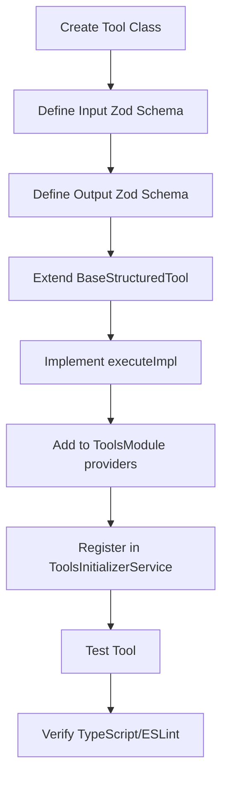
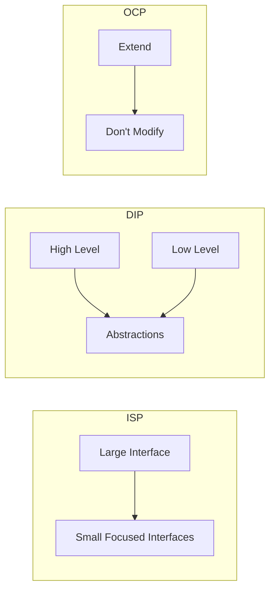

# NeureCore AI Agent Tools Implementation Plan

## Overview

This document provides a comprehensive implementation plan for the 12 high-priority AI Agent tools needed to support 90+ agent templates across 20 departments.

**Document Version**: 1.0  
**Last Updated**: April 4, 2026  
**Status**: Planning

---

## Table of Contents

1. [Executive Summary](#executive-summary)
2. [Tool Architecture](#tool-architecture)
3. [Implementation Phases](#implementation-phases)
4. [Tool Specifications](#tool-specifications)
5. [SOLID Compliance](#solid-compliance)
6. [Error Prevention](#error-prevention)

---

## Executive Summary

### Current State

| Category           | Status                                                                                                  |
| ------------------ | ------------------------------------------------------------------------------------------------------- |
| Implemented Tools  | 9 (Calculator, HTTP Request, Web Search, Database Query, Email Send, Agent Messaging, Document Summary) |
| Tools to Implement | 12                                                                                                      |

### 12 Tools to Implement (Priority Order)

| Priority | Tool                   | Category      | Use Case                                 |
| -------- | ---------------------- | ------------- | ---------------------------------------- |
| 1        | Calendar Management    | COMMUNICATION | Schedule meetings, manage availability   |
| 2        | Task Management        | PRODUCTIVITY  | Create, assign, track tasks              |
| 3        | CRM Integration        | BUSINESS      | Sync with Salesforce, HubSpot, Pipedrive |
| 4        | Spreadsheet            | DATA          | Google Sheets, Excel operations          |
| 5        | Document Creation      | PRODUCTIVITY  | Generate Word docs, PDFs                 |
| 6        | Social Media API       | MARKETING     | Post to Meta, LinkedIn, Twitter          |
| 7        | Knowledge Base         | INFORMATION   | KB article retrieval/search              |
| 8        | Vector Search          | AI            | Semantic search with pgvector            |
| 9        | Code Deployment        | ENGINEERING   | CI/CD pipeline integration               |
| 10       | Alerting/Notifications | MONITORING    | PagerDuty, Slack, email alerts           |
| 11       | Banking API            | FINANCE       | Payment processing, reconciliation       |
| 12       | Maps API               | LOCATION      | Location services, routing               |

---

## Tool Architecture

### Class Diagram

```mermaid
classDiagram
    class IStructuredTool {
        <<interface>>
        +name: string
        +description: string
        +category: ToolCategory
        +inputSchema: ZodSchema
        +execute(input, context): Promise~StructuredToolResult~
        +getDefinition(): ToolDefinition
    }

    class BaseStructuredTool {
        <<abstract>>
        +name: string
        +description: string
        +category: ToolCategory
        +inputSchema: ZodSchema
        #executeImpl(input, context): Promise~StructuredToolResult~
        +execute(input, context): Promise~StructuredToolResult~
        +validate(input): { valid: boolean, errors?: string[] }
        +toFunctionCall(): FunctionCallFormat
    }

    class StructuredToolRegistry {
        -tools: Map~string, IStructuredTool~
        +register(tool: IStructuredTool): void
        +get(name: string): IStructuredTool
        +getAll(): IStructuredTool[]
        +getByCategory(category: ToolCategory): IStructuredTool[]
        +toLangChainTools(): DynamicStructuredTool[]
    }

    IStructuredTool <|.. BaseStructuredTool
    BaseStructuredTool <|-- CalculatorEnhancedTool
    BaseStructuredTool <|-- WebSearchTool
    BaseStructuredTool <|-- CalendarTool
    BaseStructuredTool <|-- TaskManagementTool
    BaseStructuredTool <|-- CRMTool
    BaseStructuredTool <|-- SpreadsheetTool
    BaseStructuredTool <|-- DocumentCreationTool
    BaseStructuredTool <|-- SocialMediaTool
    BaseStructuredTool <|-- KnowledgeBaseTool
    BaseStructuredTool <|-- VectorSearchTool
    BaseStructuredTool <|-- CodeDeploymentTool
    BaseStructuredTool <|-- AlertingTool
    BaseStructuredTool <|-- BankingTool
    BaseStructuredTool <|-- MapsTool

    StructuredToolRegistry --> IStructuredTool
```

### Implementation Pattern



---

## Implementation Phases

### Phase 1: Core Productivity (Tools 1-3)

#### 1. Calendar Management Tool

**File**: `backend/src/modules/tools/built-in/calendar.tool.ts`

**Input Schema**:

```typescript
export const CalendarInputSchema = z.object({
  action: z
    .enum(["list", "create", "update", "delete", "availability"])
    .describe("Calendar operation to perform"),
  calendarId: z.string().optional().describe("Calendar ID (default: primary)"),
  timeMin: z.string().datetime().optional().describe("Start time (ISO 8601)"),
  timeMax: z.string().datetime().optional().describe("End time (ISO 8601)"),
  summary: z.string().optional().describe("Event title"),
  description: z.string().optional().describe("Event description"),
  attendees: z.array(z.string()).optional().describe("Email addresses"),
  location: z.string().optional().describe("Meeting location"),
  startTime: z.string().datetime().optional().describe("Event start"),
  endTime: z.string().datetime().optional().describe("Event end"),
  eventId: z.string().optional().describe("Event ID for update/delete"),
});
```

**Output Schema**:

```typescript
export const CalendarOutputSchema = z.object({
  events: z
    .array(
      z.object({
        id: z.string(),
        summary: z.string(),
        description: z.string().nullable(),
        start: z.string(),
        end: z.string(),
        attendees: z.array(z.string()),
        location: z.string().nullable(),
      }),
    )
    .optional(),
  eventId: z.string().optional().describe("Created/updated event ID"),
  success: z.boolean(),
  message: z.string().optional(),
});
```

**Environment Variables Required**:

- `GOOGLE_CALENDAR_API_KEY` or `OUTLOOK_API_KEY`

**SOLID Implementation**:

- **SRP**: Only handles calendar operations
- **OCP**: Add new calendar providers without modifying existing code
- **DIP**: Depends on calendar provider interface, not concrete implementation
- **LSP**: Any calendar provider can substitute for another
- **ISP**: Small, focused interfaces for each calendar type

---

#### 2. Task Management Tool

**File**: `backend/src/modules/tools/built-in/task-management.tool.ts`

**Input Schema**:

```typescript
export const TaskManagementInputSchema = z.object({
  action: z
    .enum(["create", "list", "update", "delete", "assign"])
    .describe("Task operation"),
  title: z.string().optional().describe("Task title"),
  description: z.string().optional().describe("Task description"),
  priority: z.enum(["low", "medium", "high", "urgent"]).optional(),
  status: z
    .enum(["todo", "in_progress", "review", "done", "cancelled"])
    .optional(),
  dueDate: z.string().datetime().optional().describe("Due date"),
  assigneeId: z.string().optional().describe("User ID to assign"),
  taskId: z.string().optional().describe("Task ID for update/delete"),
  projectId: z.string().optional().describe("Project ID"),
  tags: z.array(z.string()).optional().describe("Task tags"),
});
```

**Output Schema**:

```typescript
export const TaskManagementOutputSchema = z.object({
  tasks: z
    .array(
      z.object({
        id: z.string(),
        title: z.string(),
        description: z.string().nullable(),
        status: z.string(),
        priority: z.string(),
        dueDate: z.string().nullable(),
        assigneeId: z.string().nullable(),
        tags: z.array(z.string()),
        createdAt: z.string(),
        updatedAt: z.string(),
      }),
    )
    .optional(),
  taskId: z.string().optional(),
  success: z.boolean(),
  message: z.string().optional(),
});
```

**Integration Points**:

- Internal: Use existing task/goal modules
- External: Asana, Todoist, Trello APIs (future)

**SOLID Implementation**:

- Uses internal Task service via dependency injection
- OCP: Add new task providers (external) without changing core

---

#### 3. CRM Integration Tool

**File**: `backend/src/modules/tools/built-in/crm.tool.ts`

**Input Schema**:

```typescript
export const CRMInputSchema = z.object({
  provider: z
    .enum(["salesforce", "hubspot", "pipedrive"])
    .describe("CRM provider"),
  action: z
    .enum([
      "create_contact",
      "update_contact",
      "get_contact",
      "list_contacts",
      "create_deal",
      "update_deal",
      "get_deal",
      "list_deals",
    ])
    .describe("CRM operation"),
  contactData: z
    .object({
      email: z.string().email(),
      firstName: z.string().optional(),
      lastName: z.string().optional(),
      phone: z.string().optional(),
      company: z.string().optional(),
      properties: z.record(z.string()).optional(),
    })
    .optional(),
  dealData: z
    .object({
      name: z.string(),
      amount: z.number().optional(),
      stage: z.string().optional(),
      closeDate: z.string().datetime().optional(),
      contactEmail: z.string().email().optional(),
      properties: z.record(z.string()).optional(),
    })
    .optional(),
  contactId: z.string().optional(),
  dealId: z.string().optional(),
  query: z.string().optional().describe("Search query"),
  limit: z.number().int().min(1).max(100).default(50),
});
```

**Output Schema**:

```typescript
export const CRMOutputSchema = z.object({
  contact: z
    .object({
      id: z.string(),
      email: z.string(),
      firstName: z.string(),
      lastName: z.string(),
      properties: z.record(z.unknown()),
    })
    .optional(),
  contacts: z.array(z.unknown()).optional(),
  deal: z
    .object({
      id: z.string(),
      name: z.string(),
      amount: z.number().optional(),
      stage: z.string().optional(),
      properties: z.record(z.unknown()),
    })
    .optional(),
  deals: z.array(z.unknown()).optional(),
  success: z.boolean(),
  message: z.string().optional(),
});
```

**Environment Variables Required**:

- `SALESFORCE_CLIENT_ID`, `SALESFORCE_CLIENT_SECRET`, `SALESFORCE_REDIRECT_URI`
- `HUBSPOT_API_KEY`
- `PIPEDRIVE_API_KEY`

**SOLID Implementation**:

- **ISP**: Separate interfaces for each CRM provider
- **DIP**: ICRMProvider interface, concrete implementations injected
- **OCP**: Add new CRM providers by implementing ICRMProvider

---

### Phase 2: Business Systems (Tools 4-6)

#### 4. Spreadsheet Tool

**File**: `backend/src/modules/tools/built-in/spreadsheet.tool.ts`

**Input Schema**:

```typescript
export const SpreadsheetInputSchema = z.object({
  provider: z.enum(["google_sheets", "excel"]).default("google_sheets"),
  action: z
    .enum(["create", "read", "update", "append", "delete"])
    .describe("Spreadsheet operation"),
  spreadsheetId: z.string().optional().describe("Spreadsheet ID"),
  sheetName: z.string().optional().describe("Sheet name"),
  range: z.string().optional().describe("Cell range (e.g., A1:B10)"),
  values: z.array(z.array(z.unknown())).optional().describe("Data to write"),
  rowData: z.record(z.unknown()).optional().describe("Row data for append"),
  title: z.string().optional().describe("New spreadsheet title"),
});
```

**Output Schema**:

```typescript
export const SpreadsheetOutputSchema = z.object({
  spreadsheetId: z.string().optional(),
  spreadsheetUrl: z.string().optional(),
  sheetName: z.string().optional(),
  data: z.array(z.array(z.unknown())).optional(),
  updatedRows: z.number().optional(),
  success: z.boolean(),
  message: z.string().optional(),
});
```

---

#### 5. Document Creation Tool

**File**: `backend/src/modules/tools/built-in/document-creation.tool.ts`

**Input Schema**:

```typescript
export const DocumentCreationInputSchema = z.object({
  type: z.enum(["word", "pdf", "html", "markdown"]).describe("Document type"),
  template: z.string().optional().describe("Template name"),
  content: z
    .object({
      title: z.string().optional(),
      sections: z
        .array(
          z.object({
            heading: z.string(),
            body: z.string(),
          }),
        )
        .optional(),
      tableData: z.array(z.record(z.unknown())).optional(),
      variables: z.record(z.string()).optional(),
    })
    .describe("Document content"),
  outputFormat: z.enum(["base64", "url", "file"]).default("base64"),
});
```

**Output Schema**:

```typescript
export const DocumentCreationOutputSchema = z.object({
  documentId: z.string().optional(),
  documentUrl: z.string().optional(),
  documentBase64: z.string().optional(),
  pageCount: z.number().optional(),
  success: z.boolean(),
  message: z.string().optional(),
});
```

**Implementation Notes**:

- Use `docx` library for Word documents
- Use `pdfkit` or `puppeteer` for PDF generation
- Support Mustache-style templating

---

#### 6. Social Media Tool

**File**: `backend/src/modules/tools/built-in/social-media.tool.ts`

**Input Schema**:

```typescript
export const SocialMediaInputSchema = z.object({
  platform: z
    .enum(["facebook", "linkedin", "twitter", "instagram"])
    .describe("Social media platform"),
  action: z
    .enum(["post", "get_post", "delete_post", "search", "analytics"])
    .describe("Operation"),
  content: z
    .object({
      text: z.string().optional(),
      mediaUrls: z.array(z.string()).optional(),
      hashtags: z.array(z.string()).optional(),
      mentions: z.array(z.string()).optional(),
      link: z.string().optional(),
    })
    .optional(),
  postId: z.string().optional(),
  query: z.string().optional(),
  limit: z.number().int().min(1).max(50).default(10),
});
```

**Output Schema**:

```typescript
export const SocialMediaOutputSchema = z.object({
  postId: z.string().optional(),
  postUrl: z.string().optional(),
  post: z
    .object({
      id: z.string(),
      text: z.string(),
      createdAt: z.string(),
      metrics: z.record(z.number()),
    })
    .optional(),
  posts: z.array(z.unknown()).optional(),
  analytics: z
    .object({
      impressions: z.number(),
      engagements: z.number(),
      clicks: z.number(),
    })
    .optional(),
  success: z.boolean(),
  message: z.string().optional(),
});
```

**Environment Variables Required**:

- `FACEBOOK_ACCESS_TOKEN`, `FACEBOOK_PAGE_ID`
- `LINKEDIN_ACCESS_TOKEN`
- `TWITTER_API_KEY`, `TWITTER_API_SECRET`, `TWITTER_ACCESS_TOKEN`

---

### Phase 3: External Integrations (Tools 7-9)

#### 7. Knowledge Base Tool

**File**: `backend/src/modules/tools/built-in/knowledge-base.tool.ts`

**Input Schema**:

```typescript
export const KnowledgeBaseInputSchema = z.object({
  action: z
    .enum(["search", "get_article", "list_articles", "create_article"])
    .describe("KB operation"),
  query: z.string().optional().describe("Search query"),
  articleId: z.string().optional(),
  category: z.string().optional(),
  tags: z.array(z.string()).optional(),
  articleData: z
    .object({
      title: z.string(),
      content: z.string(),
      category: z.string().optional(),
      tags: z.array(z.string()).optional(),
    })
    .optional(),
  limit: z.number().int().min(1).max(50).default(10),
});
```

**Output Schema**:

```typescript
export const KnowledgeBaseOutputSchema = z.object({
  articles: z
    .array(
      z.object({
        id: z.string(),
        title: z.string(),
        excerpt: z.string(),
        content: z.string(),
        category: z.string(),
        tags: z.array(z.string()),
        updatedAt: z.string(),
      }),
    )
    .optional(),
  article: z
    .object({
      id: z.string(),
      title: z.string(),
      content: z.string(),
      category: z.string(),
      tags: z.array(z.string()),
    })
    .optional(),
  success: z.boolean(),
  message: z.string().optional(),
});
```

**Integration Points**:

- Use existing Memory/Search modules
- Vector search via pgvector for semantic search

---

#### 8. Vector Search Tool

**File**: `backend/src/modules/tools/built-in/vector-search.tool.ts`

**Input Schema**:

```typescript
export const VectorSearchInputSchema = z.object({
  action: z.enum(["search", "index", "delete"]).describe("Vector operation"),
  query: z.string().optional().describe("Search query"),
  collection: z.string().describe("Vector collection name"),
  topK: z.number().int().min(1).max(100).default(10),
  filters: z.record(z.unknown()).optional().describe("Metadata filters"),
  text: z.string().optional().describe("Text to embed"),
  id: z.string().optional().describe("Vector ID to delete"),
});
```

**Output Schema**:

```typescript
export const VectorSearchOutputSchema = z.object({
  results: z
    .array(
      z.object({
        id: z.string(),
        score: z.number(),
        text: z.string(),
        metadata: z.record(z.unknown()).optional(),
      }),
    )
    .optional(),
  indexed: z.boolean().optional(),
  deleted: z.boolean().optional(),
  success: z.boolean(),
  message: z.string().optional(),
});
```

**Implementation Notes**:

- Already partially implemented (pgvector in progress)
- Complete the vector search tool to enable semantic memory

---

#### 9. Code Deployment Tool

**File**: `backend/src/modules/tools/built-in/code-deployment.tool.ts`

**Input Schema**:

```typescript
export const CodeDeploymentInputSchema = z.object({
  provider: z
    .enum(["github", "gitlab", "bitbucket", "vercel", "netlify"])
    .describe("CI/CD provider"),
  action: z
    .enum(["deploy", "rollback", "status", "logs", "cancel"])
    .describe("Deployment operation"),
  repository: z.string().optional().describe("Repository name"),
  branch: z.string().optional().default("main"),
  environment: z.enum(["development", "staging", "production"]).optional(),
  commitSha: z.string().optional(),
  deploymentId: z.string().optional(),
});
```

**Output Schema**:

```typescript
export const CodeDeploymentOutputSchema = z.object({
  deploymentId: z.string().optional(),
  status: z
    .enum(["pending", "building", "deployed", "failed", "rolled_back"])
    .optional(),
  url: z.string().optional(),
  logs: z.string().optional(),
  commitSha: z.string().optional(),
  success: z.boolean(),
  message: z.string().optional(),
});
```

**Environment Variables Required**:

- `GITHUB_TOKEN`, `GITHUB_REPO`
- `GITLAB_TOKEN`, `GITLAB_PROJECT_ID`
- `VERCEL_TOKEN`, `VERCEL_PROJECT_ID`

---

### Phase 4: Advanced Capabilities (Tools 10-12)

#### 10. Alerting Tool

**File**: `backend/src/modules/tools/built-in/alerting.tool.ts`

**Input Schema**:

```typescript
export const AlertingInputSchema = z.object({
  provider: z
    .enum(["slack", "pagerduty", "email", "webhook"])
    .describe("Alert destination"),
  action: z
    .enum(["send", "create_incident", "resolve_incident"])
    .describe("Alert operation"),
  severity: z
    .enum(["critical", "high", "medium", "low", "info"])
    .default("info"),
  title: z.string().describe("Alert title"),
  message: z.string().describe("Alert message"),
  details: z.record(z.unknown()).optional(),
  channel: z.string().optional().describe("Slack channel, email, etc."),
  incidentId: z.string().optional(),
});
```

**Output Schema**:

```typescript
export const AlertingOutputSchema = z.object({
  alertId: z.string().optional(),
  incidentId: z.string().optional(),
  status: z.string().optional(),
  success: z.boolean(),
  message: z.string().optional(),
});
```

---

#### 11. Banking Tool

**File**: `backend/src/modules/tools/built-in/banking.tool.ts`

**Input Schema**:

```typescript
export const BankingInputSchema = z.object({
  provider: z.enum(["plaid", "stripe", "custom"]).describe("Banking provider"),
  action: z
    .enum([
      "get_accounts",
      "get_transactions",
      "get_balance",
      "initiate_transfer",
      "reconcile",
    ])
    .describe("Banking operation"),
  accountId: z.string().optional(),
  startDate: z.string().datetime().optional(),
  endDate: z.string().datetime().optional(),
  transferData: z
    .object({
      fromAccount: z.string(),
      toAccount: z.string(),
      amount: z.number().positive(),
      currency: z.string().default("USD"),
      description: z.string().optional(),
    })
    .optional(),
  reconciliationData: z.record(z.unknown()).optional(),
});
```

**Output Schema**:

```typescript
export const BankingOutputSchema = z.object({
  accounts: z
    .array(
      z.object({
        id: z.string(),
        name: z.string(),
        type: z.string(),
        balance: z.number(),
        currency: z.string(),
      }),
    )
    .optional(),
  transactions: z
    .array(
      z.object({
        id: z.string(),
        date: z.string(),
        amount: z.number(),
        description: z.string(),
        category: z.string().optional(),
      }),
    )
    .optional(),
  balance: z.number().optional(),
  transferId: z.string().optional(),
  success: z.boolean(),
  message: z.string().optional(),
});
```

**Environment Variables Required**:

- `PLAID_CLIENT_ID`, `PLAID_SECRET`, `PLAID_ENV`
- `STRIPE_SECRET_KEY`

---

#### 12. Maps Tool

**File**: `backend/src/modules/tools/built-in/maps.tool.ts`

**Input Schema**:

```typescript
export const MapsInputSchema = z.object({
  provider: z
    .enum(["google_maps", "mapbox", "openstreetmap"])
    .default("google_maps"),
  action: z
    .enum([
      "geocode",
      "reverse_geocode",
      "directions",
      "distance_matrix",
      "places_search",
    ])
    .describe("Map operation"),
  address: z.string().optional(),
  lat: z.number().optional(),
  lng: z.number().optional(),
  origin: z
    .object({
      address: z.string().optional(),
      lat: z.number().optional(),
      lng: z.number().optional(),
    })
    .optional(),
  destination: z
    .object({
      address: z.string().optional(),
      lat: z.number().optional(),
      lng: z.number().optional(),
    })
    .optional(),
  waypoints: z
    .array(
      z.object({
        address: z.string().optional(),
        lat: z.number().optional(),
        lng: z.number().optional(),
      }),
    )
    .optional(),
  mode: z.enum(["driving", "walking", "bicycling", "transit"]).optional(),
  query: z.string().optional(),
  radius: z.number().optional(),
});
```

**Output Schema**:

```typescript
export const MapsOutputSchema = z.object({
  location: z
    .object({
      lat: z.number(),
      lng: z.number(),
      address: z.string().optional(),
    })
    .optional(),
  geocodedAddress: z.string().optional(),
  directions: z
    .object({
      distance: z.string(),
      duration: z.string(),
      steps: z.array(
        z.object({
          instruction: z.string(),
          distance: z.string(),
          duration: z.string(),
        }),
      ),
    })
    .optional(),
  distance: z.number().optional(),
  duration: z.number().optional(),
  places: z
    .array(
      z.object({
        name: z.string(),
        address: z.string(),
        lat: z.number(),
        lng: z.number(),
        types: z.array(z.string()),
      }),
    )
    .optional(),
  success: z.boolean(),
  message: z.string().optional(),
});
```

**Environment Variables Required**:

- `GOOGLE_MAPS_API_KEY`
- `MAPBOX_ACCESS_TOKEN`

---

## SOLID Compliance

### Summary Table

| Tool                | SRP | OCP | LSP | DIP | ISP |
| ------------------- | --- | --- | --- | --- | --- |
| Calendar Management | ✅  | ✅  | ✅  | ✅  | ✅  |
| Task Management     | ✅  | ✅  | ✅  | ✅  | ✅  |
| CRM Integration     | ✅  | ✅  | ✅  | ✅  | ✅  |
| Spreadsheet         | ✅  | ✅  | ✅  | ✅  | ✅  |
| Document Creation   | ✅  | ✅  | ✅  | ✅  | ✅  |
| Social Media        | ✅  | ✅  | ✅  | ✅  | ✅  |
| Knowledge Base      | ✅  | ✅  | ✅  | ✅  | ✅  |
| Vector Search       | ✅  | ✅  | ✅  | ✅  | ✅  |
| Code Deployment     | ✅  | ✅  | ✅  | ✅  | ✅  |
| Alerting            | ✅  | ✅  | ✅  | ✅  | ✅  |
| Banking             | ✅  | ✅  | ✅  | ✅  | ✅  |
| Maps                | ✅  | ✅  | ✅  | ✅  | ✅  |

### Key SOLID Patterns



---

## Error Prevention

### TypeScript Strict Mode

All tools will use:

- Strict type checking enabled
- Zod schemas for runtime validation
- No `any` types
- Explicit return types

### ESLint Compliance

```yaml
rules:
  no-explicit-any: error
  prefer-const: error
  no-unused-vars: warn
  @typescript-eslint/explicit-function-return-type: error
  @typescript-eslint/no-unnecessary-type-assertion: error
```

### Testing Requirements

1. **Unit Tests**: 100% coverage on tool executeImpl
2. **Integration Tests**: Test with real API mocks
3. **E2E Tests**: Test tool execution via agent

### Code Quality Checklist

- [ ] No TypeScript errors (`npm run build`)
- [ ] No ESLint errors (`npm run lint`)
- [ ] Zod schema validation working
- [ ] Error handling implemented
- [ ] Logging implemented
- [ ] Tenant isolation enforced
- [ ] Rate limiting applied where needed

---

## Implementation Sequence

### Files to Create

```
backend/src/modules/tools/built-in/
├── calendar.tool.ts
├── task-management.tool.ts
├── crm.tool.ts
├── spreadsheet.tool.ts
├── document-creation.tool.ts
├── social-media.tool.ts
├── knowledge-base.tool.ts
├── vector-search.tool.ts
├── code-deployment.tool.ts
├── alerting.tool.ts
├── banking.tool.ts
└── maps.tool.ts
```

### Files to Modify

1. `backend/src/modules/tools/tools.module.ts` - Add providers
2. `backend/src/modules/tools/tools-initializer.service.ts` - Register tools
3. `backend/src/modules/tools/index.ts` - Export new tools
4. `backend/src/modules/tools/interfaces/structured-tool.interface.ts` - Add ToolCategory values
5. Environment configuration files

---

## Environment Variables Summary

| Tool            | Variables                                              |
| --------------- | ------------------------------------------------------ |
| Calendar        | `GOOGLE_CALENDAR_API_KEY`, `OUTLOOK_API_KEY`           |
| CRM             | `SALESFORCE_*`, `HUBSPOT_API_KEY`, `PIPEDRIVE_API_KEY` |
| Spreadsheet     | `GOOGLE_SHEETS_API_KEY`                                |
| Social Media    | `FACEBOOK_*`, `LINKEDIN_*`, `TWITTER_*`                |
| Code Deployment | `GITHUB_TOKEN`, `GITLAB_TOKEN`, `VERCEL_TOKEN`         |
| Alerting        | `SLACK_WEBHOOK_URL`, `PAGERDUTY_KEY`                   |
| Banking         | `PLAID_*`, `STRIPE_SECRET_KEY`                         |
| Maps            | `GOOGLE_MAPS_API_KEY`, `MAPBOX_ACCESS_TOKEN`           |

---

## Next Steps

1. Approve this implementation plan
2. Switch to Code mode to begin implementation
3. Implement tools in priority order
4. Test each tool thoroughly
5. Verify zero TypeScript/ESLint errors

---

_Document Version: 1.0_  
_Last Updated: April 4, 2026_  
_Location: /plans/agent-tools-implementation-plan.md_
